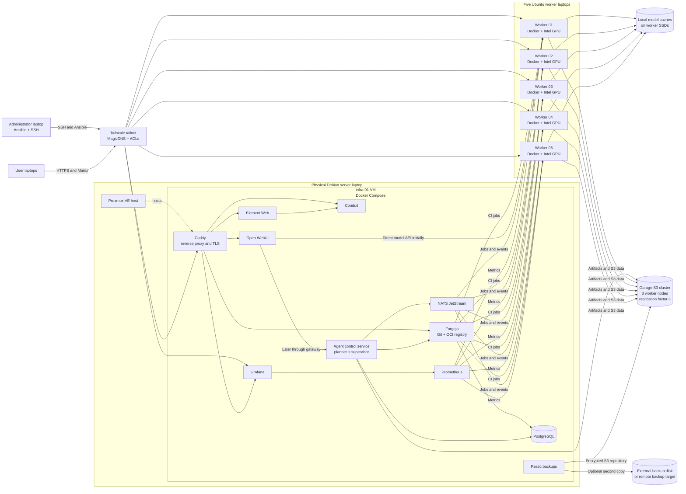
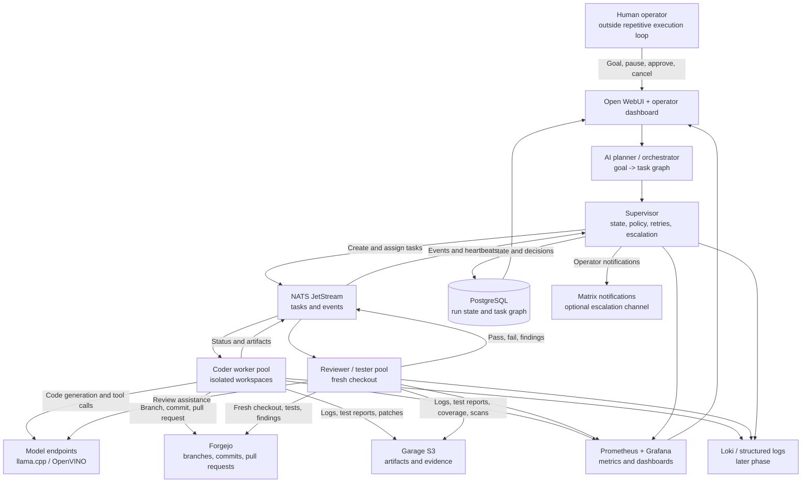
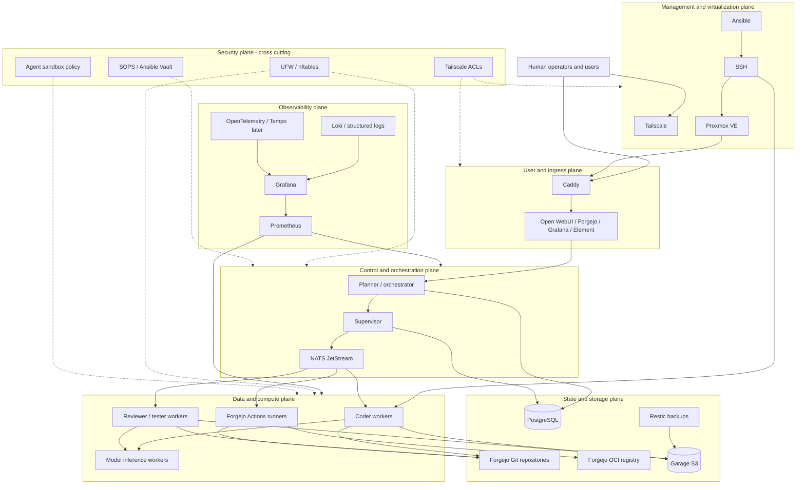

# Small AI Lab Architecture Using Free and Open-Source Software

## Scope

This is the deliberately small first version of the lab.

Current hardware and state:

- One Debian server laptop
- Five Ubuntu worker laptops
- 32 GB RAM and approximately 512 GB SSD per laptop
- Intel integrated Arc graphics on the laptops
- Tailscale tailnet already configured
- No other services currently deployed

The goal is to build a useful multi-node AI and software-agent lab without introducing Kubernetes, high-availability storage, or a large number of complex services too early.

---

# 1. Recommended Small-Lab Architecture



The purpose of this is to understand the lab environment on a small scale. The five worker laptops have Intel Ultra 5 processors, 32 GB of RAM, Intel Arc graphics, and 512 GB of SSD storage. The server laptop has similar hardware but runs Debian. The server will run Proxmox VE, while the Ubuntu workers remain bare metal for the best chance of Intel GPU compatibility.

### Proxmox placement

Proxmox VE runs directly on the Debian server laptop. It hosts an `infra-01` virtual machine that runs the control-plane Docker Compose stack. The Proxmox host should remain minimal and should not directly run Forgejo, PostgreSQL, or Docker.

The Ubuntu workers should not run Proxmox initially. Their Intel integrated GPUs are more likely to work reliably when Ubuntu and the inference runtime have direct access to the hardware. Proxmox can be evaluated for worker virtualization later, but GPU passthrough should not be a prerequisite for the first lab.

Recommended initial VM allocation:

```text
infra-01 VM
  4–6 vCPUs
  12–16 GB RAM
  100–150 GB virtual disk
  Bridged network interface
```

Use ext4 or LVM-thin for the Proxmox server storage. Do not introduce ZFS or Ceph on the single 512 GB laptop SSD at this stage.

---

# 2. Small-Lab Service List

## Services to deploy first

| Service | Placement | Why it is needed | Interactions |
|---|---|---|---|
| Tailscale | All machines | Private encrypted network connectivity. Already installed. | Admins access machines over the tailnet. Users access approved HTTPS services. Workers reach the server and other required services. |
| MagicDNS | Tailscale | Provides stable names for machines. | Ansible, SSH, browsers, and service configuration use names instead of changing IP addresses. |
| Tailscale ACLs and tags | Tailscale administration | Limits access between administrators, users, server, and workers. | Controls which devices may reach SSH, application ports, queues, and metrics. |
| SSH | All machines | Emergency administration and Ansible transport. | Ansible connects to Debian and Ubuntu systems over Tailscale. |
| Ansible | Initially administrator laptop | Makes the operating-system and service configuration repeatable. | Configures all machines and deploys Compose stacks. |
| UFW or nftables | All machines | Host firewall protection. | Allows Tailscale, SSH, HTTPS, metrics, and only the required worker-to-server traffic. |
| Chrony or systemd-timesyncd | All machines | Keeps system clocks synchronized. | Supports correct TLS, logs, Matrix events, metrics, and distributed jobs. |
| Docker Engine + Compose | `infra-01` VM and workers | Runs containers consistently without requiring Kubernetes. | Runs Forgejo, PostgreSQL, monitoring, Open WebUI, model servers, and worker processes. |
| Caddy | `infra-01` VM | Provides one HTTPS entry point and routes traffic to internal services. | Routes requests to Forgejo, Open WebUI, Grafana, Element, and Conduit. |
| Forgejo | `infra-01` VM | Git hosting, code review, issues, documentation, and automation definitions. | Uses PostgreSQL. Sends CI jobs to runners on workers. Agents clone repositories and create branches or pull requests. |
| Forgejo OCI registry | `infra-01` VM | Stores container images produced by CI. | CI runners push images. Workers and deployments pull approved images. |
| PostgreSQL | `infra-01` VM | Stores structured application and job data. | Forgejo and the future agent API use separate databases and users. |
| Prometheus | `infra-01` VM | Collects infrastructure and application metrics. | Scrapes Node Exporter, container metrics, queue metrics, and later GPU metrics. |
| Node Exporter | Server, VM, and workers | Reports CPU, RAM, disk, filesystem, and operating-system metrics. | Prometheus scrapes each node. |
| Grafana | `infra-01` VM | Displays metrics and operational dashboards. | Queries Prometheus. It is accessed through Caddy and the tailnet. |
| Restic | `infra-01` VM or administrator machine | Creates encrypted backups. | Backs up databases, Forgejo, configuration, and application data to a Garage S3 repository. Add an external second copy later. |
| Garage S3 | Three Ubuntu workers, preferably workers 01–03 | Provides hands-on experience with distributed object storage, replication, buckets, keys, and S3-compatible APIs. | Agent workers, CI jobs, Restic, and later model tooling upload and download objects. Garage nodes communicate with each other over private node-to-node RPC. |
| Proxmox VE | Physical Debian server laptop | Provides the virtualization layer for the infrastructure VM, snapshots, VM lifecycle management, and later disposable test VMs. | Hosts `infra-01`. Ansible can manage the Proxmox API and the guest operating system separately. |
| llama.cpp or OpenVINO GenAI | Ubuntu workers | Runs models on Intel GPU/CPU hardware. | Receives requests from Open WebUI initially, and from the agent API later. Reads models from local worker SSDs. |
| Open WebUI | `infra-01` VM | User-facing AI chat interface. | Calls a model server directly at first. Later calls the planner/orchestrator and supervisor services. |
| NATS JetStream | `infra-01` VM | Provides a lightweight durable queue and event bus. | The agent control service publishes jobs and state events. Coder and reviewer/tester workers consume jobs and publish status and heartbeats. |
| Agent control service | `infra-01` VM | Contains the planner/orchestrator and supervisor logic for agentic coding runs. | Receives goals from Open WebUI, stores run state in PostgreSQL, schedules work through NATS, calls model endpoints, reads Forgejo results, and sends artifacts to Garage. |
| Agent worker | Ubuntu workers | Executes code-generation and testing tasks. | Receives NATS jobs, clones Forgejo repositories, calls an inference endpoint, runs isolated jobs, and reports results. |

---

## Services to add after the first version works

| Service | Why defer it | Later interactions |
|---|---|---|
| LiteLLM | Deployed after the first direct endpoint test. | Open WebUI and agent workers call one gateway using scoped virtual keys. The gateway currently exposes the `luna` model route and can later route to multiple inference workers. |
| Loki + Grafana Alloy or Promtail | Journald and Docker log rotation are enough during initial bring-up. | Workers send logs to Loki. Grafana queries both Loki and Prometheus. Add this when agent runs become frequent. |
| OpenTelemetry Collector + Grafana Tempo or Jaeger | Distributed tracing is not needed for the first single-worker test. | Agent, supervisor, queue, model, and tool spans are correlated by run and task IDs. Add this when timing and failure analysis become difficult. |
| Proxmox metrics exporter | Node Exporter covers basic host metrics initially. | Exposes VM state, CPU, memory, storage, and task metrics from the Proxmox host to Prometheus. |
| Conduit + Element Web | Useful, but not required to validate the AI and automation platform. | Element uses Conduit for Matrix chat. Both are routed through Caddy. |
| coturn | Not needed for text-only Matrix chat. | Provides STUN/TURN for Matrix voice and video. |
| Trivy | Important once CI and container images are established. | Scans Forgejo OCI images, filesystems, and dependencies in CI. |
| SOPS with age or Ansible Vault | Can begin with carefully managed local secrets, but should be added before the repository becomes shared. | Stores encrypted deployment secrets in Forgejo. Ansible decrypts them during deployment. |
| K3s | Adds substantial operational complexity. | Schedules stateless agent jobs and inference workloads later. |
| Authentik or Authelia | Tailscale ACLs plus application accounts are sufficient for the first private lab. | Provides centralized login and SSO for Forgejo, Grafana, and Open WebUI. |
| Ray or Slurm | Not needed for independent worker inference and simple queued jobs. | Provides more advanced distributed scheduling if the workload demands it. |
| Headscale | The current Tailscale setup already works. | Provides an open-source self-hosted Tailscale control plane if strict self-hosting is required. |

---
# 3. Garage S3 in the Small Lab

Garage should be included from the beginning, but it should be deployed as a deliberately small learning cluster rather than as a production storage platform.

Use three Ubuntu workers as Garage nodes:

```text
lab-gpu-01 / lab-storage-01
lab-gpu-02 / lab-storage-02
lab-gpu-03 / lab-storage-03
```

The remaining two Ubuntu workers can focus more heavily on inference and agent jobs. The three Garage nodes may also run inference workloads, but Garage should have a dedicated data directory and enough reserved disk space.

Recommended initial Garage design:

- Three physical nodes
- One Garage process per node
- One distinct Garage zone per node
- Replication factor of three
- Stable DHCP reservations or stable LAN addresses
- Garage node-to-node RPC on the private LAN where possible
- S3 API available only to the tailnet and approved workers
- A pinned Garage version managed by Ansible
- A separate Compose project or systemd service for each Garage node
- Dedicated persistent directories such as `/srv/garage/meta` and `/srv/garage/data`

Because all laptops are in the same lab, the three nodes are not independent power or disaster-recovery zones. They still provide useful practice with distributed storage and node failure, but this is not equivalent to production-grade geographic redundancy.

Start with approximately 100–120 GB of Garage capacity on each node. With replication factor three, the useful replicated capacity will be roughly one node's allocation, minus metadata and operational overhead. Do not fill the entire SSD with Garage data.

Create separate buckets and keys for different purposes:

```text
lab-artifacts
agent-results
ci-cache
restic-server-backup
model-metadata
```

Use separate S3 keys for each application. Do not use the Garage administrator key inside Open WebUI, CI, or agent workers.

Garage is useful for learning and for storing artifacts, but it is not automatically a backup of itself. Keep an external or off-site copy of important data once the lab becomes valuable.

## Garage learning exercises

After deployment, practice:

1. Create a bucket.
2. Create an application-specific access key.
3. Upload and download an object with an S3 client.
4. Configure Restic to use Garage as an S3 repository.
5. Stop one Garage node and verify the expected behavior.
6. Restart the node and verify recovery.
7. Add a fourth node later and perform a layout change.
8. Monitor disk usage and replication health.
9. Restore a file from the Restic repository.

Use the Garage documentation for the exact commands for the pinned release because layout and key-management commands can change between versions.

---

# 4. Suggested 512 GB Storage Layout

Do not immediately create rigid partitions. Start with directories and monitor actual usage. Keep at least 15–20% of each SSD free.

## Debian server

The server should not store a complete model cache initially. Reserve it for control-plane services:

| Use | Approximate allocation |
|---|---:|
| Debian OS and packages | 50–70 GB |
| Docker data and Compose stacks | 60–100 GB |
| Forgejo repositories and registry | 80–120 GB |
| PostgreSQL and application data | 40–80 GB |
| Prometheus data and logs | 50–80 GB |
| Temporary backup staging | 50–100 GB |
| Unallocated safety margin | At least 80 GB |

The exact allocation depends on how many repositories, container images, logs, and Matrix media files you keep.

## Each Ubuntu worker

### Garage storage workers: Ubuntu workers 01–03

| Use | Approximate allocation |
|---|---:|
| Ubuntu OS and packages | 50–60 GB |
| Docker data and images | 40–60 GB |
| Garage data allocation | 100–120 GB |
| Local model cache | 150–200 GB |
| Agent workspaces and build outputs | 30–50 GB |
| Free SSD space | At least 80–100 GB |

Keep Garage's data directory separate from model caches and agent workspaces. The Garage allocation is a capacity limit for the initial layout, not a requirement to partition the disk immediately.

### Compute-focused workers: Ubuntu workers 04–05

| Use | Approximate allocation |
|---|---:|
| Ubuntu OS and packages | 50–70 GB |
| Docker data and images | 50–80 GB |
| Local model cache | 220–280 GB |
| Agent workspaces and build outputs | 50–70 GB |
| Free SSD space | At least 80–100 GB |

Use automatic cleanup for:

- Old Docker images
- Failed job workspaces
- Old model versions
- Build caches
- Old logs

Configure disk alerts at approximately 75% and 85% usage.

## Model storage guidance

Because GPU memory is shared with system memory, begin with relatively small quantized models:

- 7B or 8B models
- 10B–14B models if benchmarks are acceptable
- Avoid assuming that 32B or 70B models will be practical

Store one or two standard models on every worker instead of filling every disk with many model variants.

Use Garage for model metadata, checksums, adapters, and selected shared model artifacts. Keep the active inference cache on each worker's local SSD so inference does not depend on S3 availability for every request.

---

# 5. Service Interactions

## 5.1 User AI chat

```text
User laptop
  -> Tailscale
  -> Caddy
  -> Open WebUI
  -> LiteLLM gateway (virtual key, model name: luna)
  -> llama.cpp/OpenVINO server on a selected worker
  -> Intel GPU
  -> response to Open WebUI
```

The first gateway deployment uses one `luna` route and PostgreSQL-backed virtual keys. Add additional `model_list` entries with the same public model name as more inference workers become available; LiteLLM can then load-balance the worker endpoints without changing Open WebUI or worker clients.

## 5.2 Agent coding task

```text
Open WebUI or a future API client
  -> Agent API
  -> PostgreSQL job record
  -> NATS JetStream
  -> Agent worker on an Ubuntu laptop
  -> Forgejo repository
  -> Inference endpoint
  -> isolated code/test process
  -> Forgejo branch or pull request
  -> job result returned to the user
```

The initial agent implementation can be a small Python service using:

- FastAPI
- `nats-py`
- PostgreSQL client library
- Git command-line client or GitPython
- A controlled subprocess/container execution layer

Do not introduce Temporal, Ray, Kubernetes, or a large agent platform until the simple workflow has demonstrated a need for them.

## 5.3 CI workflow

```text
Developer or agent pushes branch to Forgejo
  -> Forgejo Actions runner on a worker
  -> tests and build
  -> optional Trivy scan
  -> image pushed to Forgejo OCI registry
  -> approved image is deployed or tested
```

Do not mount `/var/run/docker.sock` into untrusted agent jobs. Use dedicated runners, rootless containers, or disposable workers where possible.

## 5.4 Monitoring workflow

```text
Workers and server
  -> Node Exporter
  -> Prometheus
  -> Grafana dashboards and alerts
```

Start with Prometheus, Node Exporter, and Grafana. Add Loki after the core platform is stable.

## 5.5 Garage and backup workflow

```text
PostgreSQL dumps + Forgejo data + Compose files + Ansible repository
  -> Restic
  -> Garage S3 bucket
  -> optional external or off-site second copy
```

Garage gives you practical S3 experience and protects the server's backup repository from a single server-disk failure, but it is still located in the same lab. It does not protect against theft, fire, a shared power event, accidental deletion of the Garage cluster, or a bad administrative command. Add an external or off-site copy for important data.

---

# 6. Agentic AI Coder Topology and Visibility

## 6.1 Agent Communication Model

Agents communicate through the supervisor and NATS JetStream rather than through unrestricted direct conversations. The supervisor remains responsible for task assignment, state transitions, retries, and escalation.

```text
Human
  -> Open WebUI or operator interface
  -> Planner/orchestrator
  -> Supervisor
  -> NATS JetStream
  -> Coder and reviewer/tester workers
```

### Communication responsibilities

| Information | Communication or storage system |
|---|---|
| Human requests | Open WebUI to the agent-control API |
| Task assignments and live events | NATS JetStream |
| Current run and task state | PostgreSQL |
| Source code, branches, commits, and reviews | Forgejo |
| Large reports, patches, test logs, and artifacts | Garage S3 |
| Model requests | HTTP/OpenAI-compatible inference API |
| Metrics and dashboards | Prometheus and Grafana |
| Human notifications | Matrix or another notification channel |

### Agent task flow

```text
1. Human submits a goal through Open WebUI.
2. Planner creates a task graph.
3. Supervisor records the run in PostgreSQL.
4. Supervisor publishes a coder task to NATS.
5. A coder worker claims the task.
6. The coder clones the repository from Forgejo.
7. The coder creates a branch, changes code, and runs tests.
8. The coder pushes the branch and commit to Forgejo.
9. The coder uploads reports and artifacts to Garage.
10. The coder publishes task.completed to NATS.
11. Supervisor creates a reviewer/tester task.
12. Reviewer checks out the coder commit from Forgejo.
13. Reviewer runs tests, linting, and security checks.
14. Reviewer publishes passed, failed, or changes_requested.
15. Supervisor retries, accepts, or escalates the run.
```

The coder and reviewer do not need to directly communicate with one another. They communicate through the supervisor, Forgejo, Garage, and NATS. This preserves auditability and prevents a coder from approving its own work.

### NATS subjects

Use structured subjects so workers can subscribe only to the roles they need:

```text
lab.command.task.assign.coder
lab.command.task.assign.reviewer
lab.event.task.started
lab.event.task.progress
lab.event.task.completed
lab.event.task.failed
lab.event.review.requested
lab.event.review.completed
lab.event.worker.heartbeat
lab.event.approval.required
```

Coder workers can consume `lab.command.task.assign.coder`. Reviewer workers can consume `lab.command.task.assign.reviewer`. Queue groups allow multiple workers to share work without processing the same task unnecessarily.

### Task message example

Messages should be small and structured. Store source code, logs, and large files in their proper systems rather than placing them directly in NATS.

```json
{
  "event_type": "task.assign",
  "run_id": "run-123",
  "task_id": "task-456",
  "parent_task_id": "task-001",
  "role": "coder",
  "repository": "team/project",
  "base_commit": "abc123",
  "branch": "agent/run-123/task-456",
  "requirements": [
    "Add user authentication",
    "Add unit tests"
  ],
  "acceptance_criteria": [
    "Existing tests pass",
    "New authentication tests pass",
    "No high-severity security findings"
  ],
  "max_attempts": 3
}
```

A result event should include the commit, status, worker, attempt, and artifact references:

```json
{
  "event_type": "task.completed",
  "run_id": "run-123",
  "task_id": "task-456",
  "role": "coder",
  "agent_id": "coder-02",
  "worker_id": "lab-gpu-04",
  "attempt": 1,
  "status": "completed",
  "repository": "team/project",
  "branch": "agent/run-123/task-456",
  "commit_sha": "def456",
  "tests_passed": true,
  "artifact_refs": [
    "s3://agent-results/run-123/task-456/test-report.json"
  ]
}
```

### Reliability and security

Each task should have a `run_id`, `task_id`, `attempt`, `agent_id`, `worker_id`, status, timestamps, parent task, commit reference, and artifact references.

Workers should send heartbeats. If the supervisor stops receiving heartbeats:

1. Mark the worker unavailable.
2. Check whether the task completed.
3. Requeue the task if appropriate.
4. Increment the attempt number.
5. Send it to another worker.
6. Escalate after the retry limit.

Use NATS acknowledgements and durable consumers for task delivery. Use PostgreSQL for durable current state. Use separate NATS credentials and subject permissions for planner, supervisor, coder, reviewer, and monitoring services.

Agents must not receive Proxmox administrator credentials, Tailscale administration keys, Ansible private keys, PostgreSQL superuser credentials, Garage administrator keys, or unrestricted access to the Docker socket.

## 6.2 Execution model

The human should be **outside the repetitive execution loop**, but not outside governance. The AI system may plan, code, test, review, and retry without a person approving every small action. A human should still be required for high-impact actions such as merging to the protected branch, deploying, accessing secrets, changing infrastructure, or overriding security findings.

The logical roles are:

| Role | Responsibility | Authority |
|---|---|---|
| Human operator | Defines goals, observes progress, approves high-impact actions, and handles escalations. | Can approve, pause, cancel, or reject a run. |
| Planner/orchestrator | Converts a goal into a task graph with dependencies, budgets, required roles, and acceptance criteria. | Creates tasks but should not directly merge or deploy code. |
| Supervisor | Owns the run state, assigns tasks, checks results, decides whether to retry, and escalates when policy or confidence thresholds are exceeded. | Can start or stop worker tasks, but should not bypass approval gates. |
| Coder | Implements a task in an isolated workspace and a Forgejo branch. | Can modify its assigned branch and produce artifacts. It cannot approve its own work. |
| Reviewer/tester | Uses a fresh checkout to review changes, run tests, linting, security scans, and acceptance checks. | Reports pass, fail, or requested changes to the supervisor. It should be independent from the coder context. |
| Worker runtime | Provides CPU, GPU, filesystem, network, and time-limited execution environments. | Executes only the job and credentials assigned to it. |

For the small lab, planner and supervisor should initially be logical modules in one `agent-control` service rather than separate microservices. Coder and reviewer/tester should be separate worker roles and preferably separate tasks or workers.

## 6.3 Agent topology



The execution loop is:

```text
Human gives a goal
        |
        v
Planner creates a task graph
        |
        v
Supervisor assigns tasks
        |
        ├── Coder creates a branch and implements the task
        |
        └── Reviewer/tester independently checks the branch
                    |
                    v
           Results return to supervisor
                    |
          ┌─────────┼──────────┐
          │         │          │
       Accept    Retry      Escalate
          │         │          │
          v         └──> Coder
     Approval gate
          |
          v
     Merge or deploy
```

The coder and reviewer/tester should not share the same unchecked context. The reviewer should receive the branch, requirements, acceptance criteria, and test environment, but should independently evaluate the result.

## 6.4 Where visibility belongs

Do not put all visibility in application logs. Logs are useful for debugging, but they are a poor source of current workflow state. Use each system for the type of information it is best at:

| Information | System of record | Why |
|---|---|---|
| Current run and task state | PostgreSQL | Provides queryable state such as queued, running, blocked, passed, failed, cancelled, or awaiting approval. |
| Task graph and parent/child relationships | PostgreSQL | Makes planner, supervisor, coder, and reviewer relationships visible. |
| Live task assignments and heartbeats | NATS JetStream | Provides decoupled task delivery and worker events. Persist important state changes to PostgreSQL. |
| Source code, branches, commits, and pull requests | Forgejo | The authoritative source for code changes and review history. |
| Large logs, test reports, patches, screenshots, build outputs, and traces | Garage S3 | Stores durable artifacts without bloating PostgreSQL or Git. |
| CPU, RAM, GPU, queue, latency, and success metrics | Prometheus | Designed for numeric time-series data and alerting. |
| Dashboards and human overview | Grafana and an agent run view | Gives the operator a current view without reading raw events. |
| Container and application logs | Journald initially; Loki later | Provides detailed debugging history. |
| End-to-end request timing | OpenTelemetry and Tempo/Jaeger later | Shows where time was spent across planner, supervisor, queue, worker, model, and test services. |
| Human notifications and escalations | Matrix or another notification channel | Alerts the human only when attention is required. |

## 6.5 Event and record design

Every task event should carry correlation fields so that a human can follow one run across every service:

```json
{
  "event_id": "evt-...",
  "event_type": "task.completed",
  "run_id": "run-...",
  "task_id": "task-...",
  "parent_task_id": "task-...",
  "role": "coder",
  "agent_id": "coder-03",
  "worker_id": "lab-gpu-04",
  "attempt": 2,
  "status": "passed",
  "repository": "team/project",
  "branch": "agent/run-123/task-456",
  "commit_sha": "...",
  "model": "model-name",
  "started_at": "...",
  "finished_at": "...",
  "artifact_refs": ["s3://agent-results/run-123/task-456/report.json"]
}
```

Do not put passwords, API keys, or unrestricted raw secrets into events. Prompt and model-response records should be sanitized and access-controlled. Store large or sensitive records in Garage with retention rules rather than placing them permanently in NATS or PostgreSQL.

## 6.6 What the human should see

### Human overview dashboard

The first screen should show:

- Active runs
- Current stage for each run
- Runs waiting for human approval
- Blocked tasks
- Failed tasks and retry count
- Current coder and reviewer assignments
- Queue depth
- Model availability
- Worker health
- GPU temperature and utilization
- Estimated token usage or local resource usage
- Latest test status
- Security findings

This should be a high-level operational view, not a stream of every model token.

### Run detail view

Selecting a run should show:

- Original goal
- Generated plan
- Task graph
- Current supervisor decision
- Coder branch and commit
- Files changed and diff link in Forgejo
- Reviewer/tester result
- Test and security reports
- Model and worker used
- Retry history
- Tool calls and execution duration
- Artifact links in Garage
- Approval history

### Infrastructure dashboard

Grafana should show:

- Proxmox host and `infra-01` VM health
- Worker CPU, RAM, disk, and temperature
- Intel GPU utilization and memory pressure
- Inference latency and tokens/second
- NATS queue depth and consumer health
- PostgreSQL health
- Garage node health and disk usage
- Backup age and last successful restore test

## 6.7 Metrics to collect

### Workflow metrics

- Active runs
- Tasks by state
- Queue wait time
- Task execution time
- Retry count
- Failure rate
- Time awaiting review
- Time awaiting human approval
- Run completion time

### Model metrics

- Request count
- Request latency
- Tokens generated
- Tokens/second
- Model errors
- Context length
- Worker selected
- Model fallback count

### Code-quality metrics

- Files changed
- Lines added and removed
- Tests passed and failed
- Lint failures
- Type-check failures
- Security findings
- Review iterations
- Pull requests accepted or rejected

### Worker metrics

- CPU and RAM usage
- GPU temperature and utilization
- Disk usage
- Sandbox duration
- Worker heartbeat age
- Container failures
- Network and S3 transfer errors

## 6.8 Notifications and escalation

Do not notify the human about every event. Notify when attention is required:

- A plan is ready for optional approval
- A run is blocked
- A task fails repeatedly
- The reviewer rejects a change
- Tests fail after the retry limit
- A security scan finds a high-severity issue
- The agent requests a secret or elevated capability
- The agent wants to merge to a protected branch
- The agent wants to deploy or change infrastructure
- A worker, model endpoint, Garage node, or backup fails
- A run completes

Matrix is a good notification channel because Conduit and Element are already part of the planned lab, but the primary run history should remain in PostgreSQL, Forgejo, Garage, and Grafana.

## 6.9 Implementation order for visibility

Implement visibility in layers:

1. Add `run_id`, `task_id`, `role`, `worker_id`, `attempt`, and timestamps to every task.
2. Persist current run and task state in PostgreSQL.
3. Publish task events and worker heartbeats through NATS.
4. Store code and review history in Forgejo.
5. Store reports and large artifacts in Garage.
6. Expose Prometheus metrics from the supervisor and workers.
7. Build Grafana overview and worker dashboards.
8. Add structured JSON logs.
9. Add Loki when multiple workers make log searching difficult.
10. Add OpenTelemetry and Tempo/Jaeger when cross-service timing is difficult to understand.
11. Add Matrix notifications for escalation and approval events.

This gives the human the right information at the right level: overview first, run timeline second, detailed logs and artifacts only when investigating a problem.

# 7. Recommended Deployment Order

## Stage 1 — Record the current state

1. Record the Debian version on the server.
2. Record the Ubuntu version on each worker.
3. Record Tailscale hostnames and IPs.
4. Record CPU, GPU, RAM, disk size, and disk health.
5. Confirm SSH connectivity over the tailnet.

## Stage 2 — Install Proxmox and create the Ansible baseline

The Debian server becomes the Proxmox host. Do not install Docker, Forgejo, or PostgreSQL directly on the Proxmox host.

1. Back up any useful data from the current Debian installation.
2. Install Proxmox VE using a supported installation method for the Debian version.
3. Configure the Proxmox bridge and management networking.
4. Install Tailscale on the Proxmox host for host administration.
5. Create the `infra-01` VM with 4–6 vCPUs, 12–16 GB RAM, and a 100–150 GB virtual disk.
6. Install Debian or Ubuntu Server inside `infra-01`.
7. Create the Ansible user and SSH keys on `infra-01` and the Ubuntu workers.
8. Configure hostnames and package updates.
9. Configure Chrony or systemd-timesyncd.
10. Configure the Proxmox firewall or nftables on the host, and UFW/nftables inside guests and workers as appropriate.
11. Install Docker Engine and Compose inside `infra-01` and on the workers, never directly on the Proxmox host.
12. Configure disk monitoring and Node Exporter on the Proxmox host, `infra-01`, and workers.
13. Configure worker power and sleep settings.
14. Install Intel GPU packages on the Ubuntu workers.

Test against the Proxmox host, `infra-01`, and one Ubuntu worker before configuring all remaining workers. Keep the Proxmox host minimal and use the VM for the control-plane Compose stack.

## Stage 3 — Deploy Garage S3

Deploy Garage before the application stack so it becomes part of the platform foundation:

1. Select three Ubuntu workers as Garage nodes.
2. Assign stable names and LAN addresses.
3. Create `/srv/garage/meta` and `/srv/garage/data`.
4. Install a pinned Garage release using Ansible.
5. Configure one zone and one layout role per physical node.
6. Use a replication factor of three.
7. Apply the initial cluster layout.
8. Create buckets and application-specific keys.
9. Test S3 uploads, downloads, and access permissions.
10. Stop one node and document the observed behavior.

Keep Garage's S3 API private to the tailnet and worker network. Do not publish it to the public Internet.

## Stage 4 — Configure backups

Use Garage as the initial S3 destination for encrypted Restic backups:

1. Create a dedicated `restic-server-backup` bucket.
2. Create a dedicated Restic S3 key with access only to that bucket.
3. Back up the Ansible repository and baseline configuration.
4. Add PostgreSQL dumps once PostgreSQL is deployed.
5. Create a PostgreSQL and Forgejo restore procedure.
6. Test the restore procedure.
7. Add a separate external or off-site copy later.

## Stage 5 — Deploy the control plane

Deploy inside the `infra-01` VM:

1. Caddy
2. PostgreSQL
3. Forgejo
4. Forgejo OCI registry
5. Forgejo Actions runner integration
6. Prometheus
7. Grafana
8. NATS JetStream
9. Open WebUI

Do not deploy these services directly on the Proxmox host.

## Stage 6 — Validate one GPU worker

1. Install Intel GPU drivers and runtime.
2. Verify `/dev/dri` access.
3. Run `intel_gpu_top`, `vainfo`, `clinfo`, or `sycl-ls` as appropriate.
4. Benchmark llama.cpp and/or OpenVINO.
5. Run an OpenAI-compatible inference endpoint.
6. Connect Open WebUI directly to that endpoint.
7. Measure tokens/second, temperature, memory use, and failure behavior.

Only then replicate the worker role to the other laptops.

## Stage 7 — Add the planner, supervisor, coder, and reviewer/tester

1. Deploy the `agent-control` service inside `infra-01`.
2. Implement planner/orchestrator and supervisor as separate logical modules first.
3. Add PostgreSQL run records and task-graph state.
4. Publish task assignments, state transitions, and heartbeats through NATS.
5. Create coder worker tasks on Ubuntu workers.
6. Create reviewer/tester worker tasks using a fresh checkout of the coder branch.
7. Integrate Forgejo branches, commits, pull requests, and review comments.
8. Store reports, test logs, patches, and other large artifacts in Garage.
9. Add Prometheus metrics with `run_id`, `task_id`, role, worker, and attempt labels where practical.
10. Build the first Grafana run overview and worker dashboard.
11. Add resource limits, timeouts, retry limits, and human approval gates.
12. Add CI and security tests before allowing automatic merges or deployments.

## Stage 8 — Add optional services

Add only when there is a concrete reason:

- LiteLLM for model routing
- Matrix/Conduit and Element
- Loki for centralized logs
- OpenTelemetry with Tempo or Jaeger for distributed traces
- Proxmox metrics exporter
- Trivy and Cosign
- Authentik or Authelia
- K3s
- Headscale

---

# 8. First Goal

The first useful milestone should be:

```text
One Debian server running Proxmox VE
One `infra-01` VM running the control-plane Compose stack
Five Ubuntu workers configured by Ansible
All reachable through Tailscale
Three-node Garage S3 cluster with replication factor three
S3 bucket and application-specific access key tested
Restic backup successfully written to Garage
One Garage node stopped and recovered successfully
Planner and supervisor producing a visible task graph
Coder and reviewer/tester completing one controlled coding run
Run state visible in PostgreSQL and Grafana
Code and review history visible in Forgejo
Artifacts and reports visible in Garage
All workers monitored by Prometheus
One worker successfully running an Intel GPU inference endpoint
Open WebUI successfully sending a chat request to that worker
Backups successfully restored in a test directory
```

Once this works, the lab has a sound foundation for adding the other workers, the agent queue, Forgejo automation, Matrix, and eventually K3s.

---

# 9. Infrastructure Planes

Infrastructure planes are logical responsibilities, not necessarily separate physical networks or machines. One physical server can host several planes, but separating the responsibilities makes the architecture easier to understand, secure, monitor, and scale.

In this lab, the main planes are:

1. **Management and virtualization plane**
2. **User and ingress plane**
3. **Control and orchestration plane**
4. **Data and compute plane**
5. **State and storage plane**
6. **Observability plane**
7. **Security plane**

The planes interact, but each should have a clear responsibility.

## 9.1 Plane overview



### Important terminology

In strict networking terminology, the **data plane** is where work is executed and traffic is processed. Forgejo, PostgreSQL, and the OCI registry are better described as platform and stateful services rather than compute data-plane services.

For this lab, the distinction is:

```text
Control plane       Decides what should happen
Data/compute plane  Performs the work
State/storage plane Remembers and stores what happened
```

Forgejo, PostgreSQL, and the OCI registry are primarily part of the **state and storage plane**, although Forgejo also provides user-facing control functions such as pull requests and CI orchestration.

---

## 9.2 Management and virtualization plane

### Services

- Proxmox VE
- Ansible
- SSH
- Tailscale management access
- Host-level firewall
- Time synchronization

### Purpose

This plane creates, configures, updates, and repairs the infrastructure. It should be usable even when the application plane is broken.

The physical Debian server runs Proxmox VE. Proxmox hosts the `infra-01` VM. Ansible configures the Proxmox host, the VM, and the Ubuntu workers.

```text
Administrator laptop
  -> Tailscale
  -> SSH / Proxmox API
  -> Proxmox host
  -> infra-01 VM and worker nodes
```

### Interactions

- Ansible configures the Proxmox host and the worker operating systems.
- Proxmox creates and manages `infra-01`.
- SSH provides emergency access and is the initial Ansible transport.
- Tailscale provides private connectivity to management endpoints.
- The firewall limits management access to administrators and approved services.

### Failure behavior

If Proxmox or the server fails:

- The server-hosted control services become unavailable.
- Workers may continue a task already running locally.
- New jobs, new deployments, and central monitoring will be affected.
- The server can be rebuilt from the Ansible repository and VM backups.

Do not run application services directly on the Proxmox host. Keeping the host minimal makes recovery and upgrades safer.

---

## 9.3 User and ingress plane

### Services

- Tailscale access
- Caddy
- Open WebUI
- Forgejo web interface
- Grafana
- Element Web
- Matrix client access

### Purpose

This plane is where humans and external clients enter the lab. It provides consistent URLs and routes requests to internal services.

Example URLs:

```text
https://forgejo.<tailnet-domain>
https://ai.<tailnet-domain>
https://grafana.<tailnet-domain>
https://chat.<tailnet-domain>
```

Caddy is not required for Tailscale connectivity. It is useful here because it provides consistent HTTPS routing and hides application-specific ports.

### Interactions

```text
User laptop
  -> Tailscale
  -> Caddy
  -> Open WebUI, Forgejo, Grafana, or Element
```

Caddy should not route directly to PostgreSQL, NATS, Docker APIs, or Garage's administrative interfaces.

### Failure behavior

If Caddy fails:

- Applications may still be running.
- Direct private access may be possible for administrators.
- Normal user access through the standard URLs fails.
- Monitoring and alerts should detect the failure.

---

## 9.4 Control and orchestration plane

### Services

- Planner/orchestrator
- Supervisor
- NATS JetStream
- PostgreSQL job state
- Model gateway later, such as LiteLLM

### Purpose

This plane decides what work should happen and coordinates the workers. It should not perform untrusted code execution itself.

The planner and supervisor are logically separate even if they initially run inside the same `agent-control` service.

### Planner/orchestrator

The planner receives a human goal and creates:

- A task graph
- Task dependencies
- Required role for each task
- Acceptance criteria
- Resource limits
- Retry limits
- Required model or capability
- Approval requirements

Example:

```text
Goal: Add authentication to the application

Task 1: Inspect the repository
Task 2: Design authentication changes
Task 3: Implement backend changes
Task 4: Implement frontend changes
Task 5: Write tests
Task 6: Run security review
Task 7: Prepare pull request
```

The planner records the plan in PostgreSQL and publishes executable tasks through NATS.

### Supervisor

The supervisor owns the execution loop. It:

- Tracks task state
- Assigns tasks to workers
- Enforces dependencies
- Receives coder and reviewer/tester results
- Decides whether to retry
- Stops unsafe or runaway work
- Escalates blocked tasks
- Determines when a run is ready for approval

The supervisor should not silently mark a failed review as passed. Every state transition should be recorded.

### NATS JetStream

NATS carries commands and events between the supervisor and workers.

```text
Supervisor
  -> task.created
  -> task.assigned
  -> NATS
  -> coder or reviewer/tester worker
  -> task.started
  -> task.progress
  -> task.completed or task.failed
  -> NATS
  -> Supervisor
```

NATS is the live communication system. PostgreSQL should receive the important state transitions so the current run can still be inspected after a worker restarts.

### Failure behavior

If the supervisor fails:

- Workers may finish their current local task.
- New scheduling decisions stop.
- NATS may retain durable messages depending on configuration.
- PostgreSQL retains the last known run state.
- The supervisor should resume or reconcile unfinished work after restart.

The supervisor is the main control-plane component for the agent system.

---

## 9.5 Data and compute plane

### Services

- Coder workers
- Reviewer/tester workers
- Model inference services
- Forgejo Actions runners
- Docker and isolated sandboxes
- Intel GPU runtimes

### Purpose

This is where work actually happens:

- Code is generated.
- Tests are executed.
- Models generate responses.
- Containers are built.
- Security scans run.
- Artifacts are produced.

Workers should be replaceable. A new Ubuntu worker should be able to join the lab by running the Ansible worker role.

### Coder worker flow

```text
Supervisor assigns coding task
  -> NATS
  -> Coder worker
  -> Clone repository from Forgejo
  -> Create isolated workspace and branch
  -> Call model endpoint
  -> Modify code
  -> Run local tests
  -> Commit changes
  -> Push branch to Forgejo
  -> Upload reports to Garage
  -> Report result to supervisor
```

The coder should not merge directly to the protected branch.

### Reviewer/tester worker flow

```text
Supervisor assigns review task
  -> NATS
  -> Reviewer/tester worker
  -> Fresh checkout of coder branch
  -> Run tests, linting, type checks, and security scans
  -> Inspect diff against acceptance criteria
  -> Store reports in Garage
  -> Comment or report findings through Forgejo
  -> Return pass, fail, or changes-requested to supervisor
```

The reviewer should use a fresh checkout and independent context. This helps prevent the coder from approving its own mistakes.

### Model inference flow

```text
Coder or reviewer
  -> model endpoint
  -> llama.cpp/OpenVINO service
  -> Intel GPU or CPU
  -> generated response
```

Inference services should not need access to PostgreSQL, Proxmox, or the Docker socket.

### Failure behavior

If a worker fails:

- The supervisor detects a missed heartbeat or failed task.
- The task is marked failed or returned to the queue.
- Another worker may retry it.
- The failed worker is rebuilt or repaired independently.

If a model endpoint fails:

- The supervisor records the inference failure.
- The task can be retried on another endpoint if one exists.
- The user should see that the task is blocked or degraded rather than receiving a false success.

---

## 10.6 State and storage plane

This is the plane that stores the durable information used by the control and data planes.

| Component | Stores | Does not primarily store |
|---|---|---|
| PostgreSQL | Users, permissions, run state, task graph, statuses, retries, metadata | Large model files, Git objects, large logs, container layers |
| Forgejo Git storage | Source code, branches, commits, tags, pull-request history | Runtime job logs and model weights |
| Forgejo OCI registry | Container manifests, image configuration, and filesystem layers | Relational application state |
| Garage S3 | Test reports, patches, logs, datasets, model artifacts, agent outputs, Restic repositories | Scheduling decisions and live worker state |
| Local worker SSD | Active model cache, temporary workspaces, build cache | Authoritative long-term records |
| Restic repository | Encrypted backup snapshots | Live application state |

### Forgejo, OCI registry, and PostgreSQL interaction

```text
Coder or developer
  -> Forgejo repository
  -> branch and commit
  -> Forgejo Actions runner
  -> tests and build
  -> OCI image pushed to Forgejo registry
  -> worker pulls approved image

Forgejo
  -> PostgreSQL for users, permissions, issues, PRs, and metadata

Agent supervisor
  -> PostgreSQL for run and task state
  -> Forgejo for source and review history
  -> Garage for large reports and artifacts
```

PostgreSQL, Forgejo storage, OCI storage, and Garage should be backed up separately because restoring one does not automatically restore the others.

### Failure behavior

- PostgreSQL failure affects current state, Forgejo metadata, and agent scheduling.
- Forgejo storage failure affects source-code availability and review history.
- OCI registry failure prevents workers from pulling images but does not necessarily stop already-running containers.
- Garage node failure should leave the cluster degraded rather than immediately destroying replicated objects.
- Local worker disk failure should lose only local cache and temporary data if authoritative artifacts were uploaded to Forgejo or Garage.

---

## 8.7 Observability plane

### Services

- Prometheus
- Node Exporter
- GPU metrics exporter
- Grafana
- Structured journald/Docker logs
- Loki later
- OpenTelemetry and Tempo/Jaeger later

### Purpose

This plane answers:

- What is running?
- What is slow?
- What failed?
- Which worker handled the task?
- Which model was used?
- How many retries occurred?
- Did the reviewer pass the code?
- Is the failure in the model, queue, worker, storage, or application?

### Where information belongs

```text
Current run state       -> PostgreSQL
Live events             -> NATS
Code and review history -> Forgejo
Large evidence          -> Garage
Numeric measurements    -> Prometheus
Dashboards              -> Grafana
Detailed logs           -> Loki later
Distributed timing      -> OpenTelemetry later
Human alerts            -> Matrix or another notification channel
```

Do not make Grafana scrape raw logs to reconstruct the task state. The supervisor should write clear state transitions to PostgreSQL and publish them through NATS.

### Human-facing views

The human should have three levels of visibility:

1. **Overview** — active runs, blocked tasks, worker health, approvals, queue depth, and failures.
2. **Run timeline** — planner decisions, supervisor assignments, coder progress, reviewer results, retries, and approval gates.
3. **Evidence detail** — diffs, commits, test logs, security reports, prompts, tool calls, and artifacts.

This prevents the operator from having to read every model message while still preserving enough information to investigate a failure.

---

## 9.8 Security plane

Security is cross-cutting rather than a single server.

### Components

- Tailscale ACLs
- UFW/nftables
- Application accounts and permissions
- SOPS or Ansible Vault
- Docker/container isolation
- Agent sandbox policies
- Forgejo branch protection
- CI security scans
- Human approval gates

### Security interactions

```text
Tailscale ACLs
  -> controls network reachability

UFW/nftables
  -> limits host and service ports

Application permissions
  -> controls Git, database, S3, and dashboard access

Sandbox policy
  -> limits agent filesystem, network, CPU, RAM, and credentials

Forgejo branch protection
  -> prevents direct autonomous changes to protected branches

Human approval
  -> controls merge, deployment, infrastructure, and secret access
```

The human can remain outside the repetitive coding loop while remaining inside the governance loop.

---

## 9.9 Plane-to-plane request flow

A complete autonomous coding run looks like this:

```text
1. Human submits a goal through Open WebUI.

2. User/ingress plane routes the request through Caddy.

3. Control plane planner creates a task graph.

4. PostgreSQL records the run and task state.

5. Supervisor publishes coder and reviewer tasks to NATS.

6. Data plane workers claim the tasks.

7. Coder reads source from Forgejo and calls a model endpoint.

8. Coder writes a branch and commits back to Forgejo.

9. Reviewer/tester checks out the branch from Forgejo.

10. Reviewer runs tests and security checks.

11. Reports and large evidence are uploaded to Garage.

12. Results are returned to the supervisor through NATS.

13. Supervisor updates PostgreSQL and Grafana metrics.

14. Human receives a notification only if approval or intervention is required.

15. Approved changes are merged or deployed through CI.
```

This structure lets the system operate autonomously while preserving a complete chain of evidence from the original goal to the final code change.
